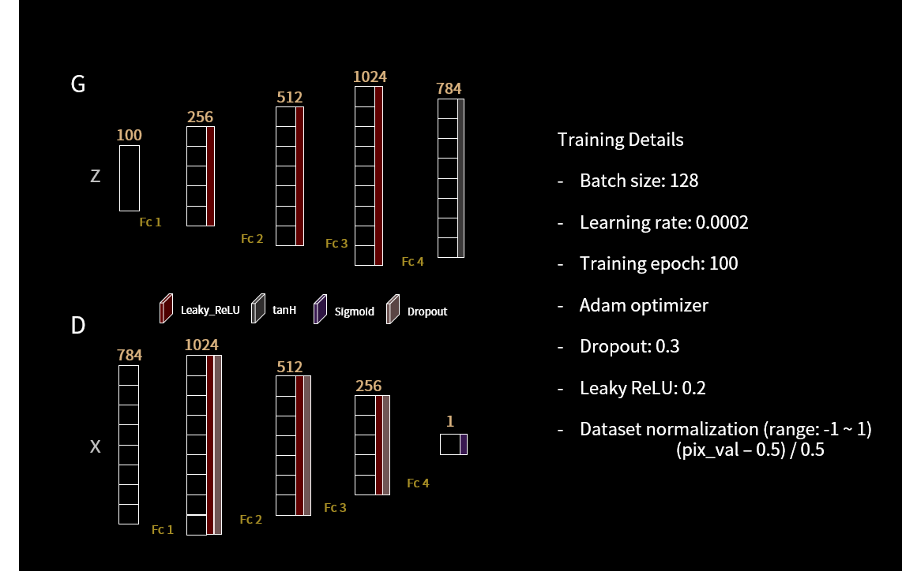
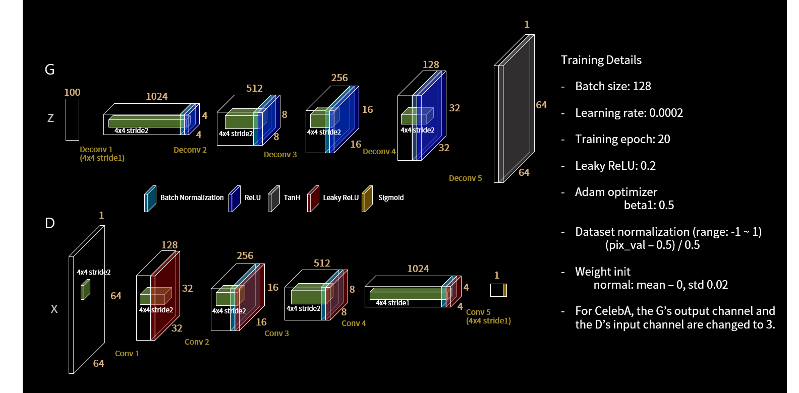
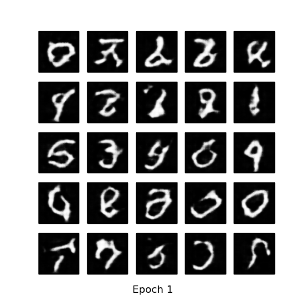
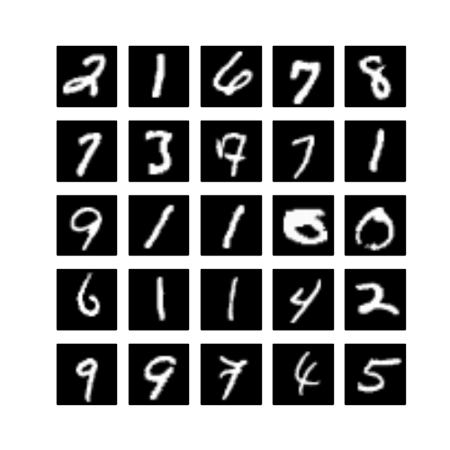
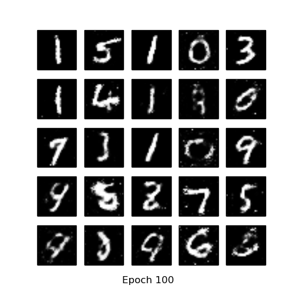
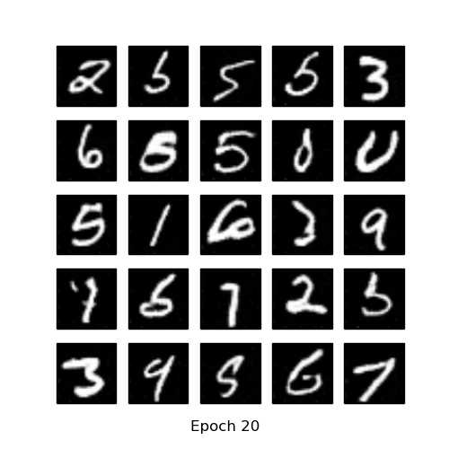
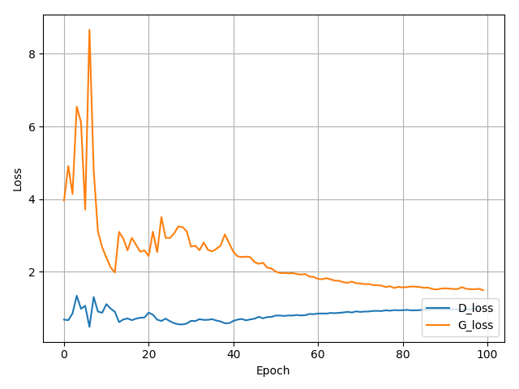

# pytorch-MNIST-CelebA-GAN-DCGAN
Pytorch implementation of Generative Adversarial Networks 

* MNIST dataset: http://yann.lecun.com/exdb/mnist/

## Implementation details
* GAN

* DCGAN

## Resutls
### MNIST
* Generate using fixed noise (fixed_z_)

<table align='center'>
<tr align='center'>
<td> GAN</td>
<td> DCGAN</td>
</tr>
<tr>
<td>
<td>
</tr>
</table>

* MNIST vs Generated images

<table align='center'>
<tr align='center'>
<td> MNIST </td>
<td> GAN after 100 epochs </td>
<td> DCGAN after 20 epochs </td>
</tr>
<tr>
<td>
<td>
<td>
</tr>
</table>

* Training loss
  * GAN

* Learning Time
  * MNIST DCGAN - Avg. per epoch: 197.86 sec; (if you want to reduce learning time, you can change 'generator(128)' and 'discriminator(128)' to 'generator(64)' and 'discriminator(64)' ... then Avg. per epoch: about 67sec in my development environment.)
  
